<p align="center">

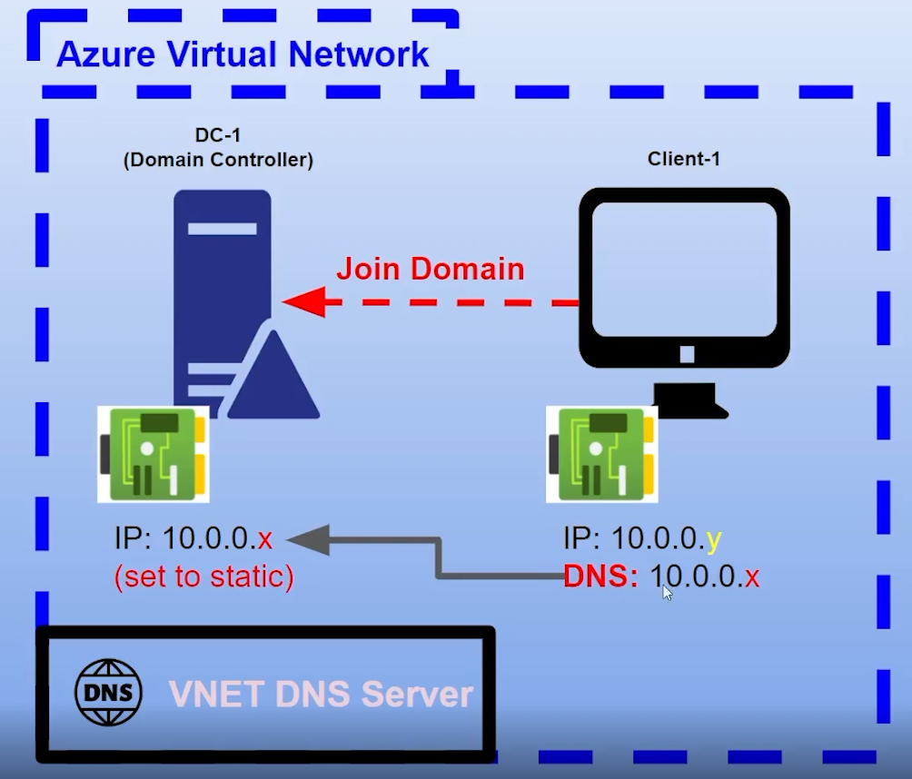

</p>

# **On-premises Active Directory Deployed in the Cloud (Azure)**

<P>
The goal of this lab is to deploy and configure Active Directory (AD) in a virtualized environment using Azure. We will create a Domain Controller (DC), join a client machine to the domain, and configure user accounts and Remote Desktop access for both administrative and non-administrative users. Finally, configure the Group Policy Object in order to build an Account Lockout Policy
</P>

<h2>Environments and Technologies Used</h2>

- Microsoft Azure (Virtual Machines/Compute)
- Remote Desktop
- Active Directory Domain Services
- PowerShell

<h2>Operating Systems Used</h2>

- Windows 10 Pro (21H2)
- Windows Server 2022

<h2>High-Level Deployment and Configuration Steps</h2>

- Create Resources
- Ensure Connectivity between the client and Domain Controller
- Install Active Directory
- Create an Admin and Normal User Account in AD
- Join `Client-1` to your domain [`myADproject.com`]
- Setup Remote Desktop for non-administrative users on Client-1
- Create a manu additional users and attempt to log into client-1 with one of the users
- Configure Account Lockout Policy Settings

<h2>Deployment and Configuration Steps</h2>

<p align="center">Setup Domain Controller in Azure</p>

- Create a Resource Group
- Create a Virtual Network and Subnet
- Create the Domain Controller VM (Windows Server 2022) named `DC-1`:
    - While creating the VM, select the previously created Resource Group
    - While creating the VM, allow it to create a new Virtual Network (Vnet) and Subnet
    - Make sure to use the password option under the Administrator Account section (not seen in image)

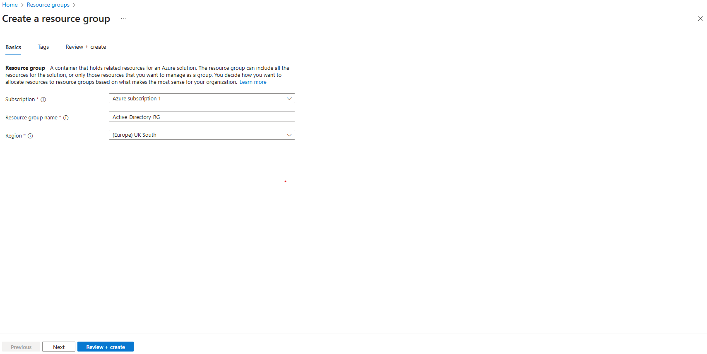
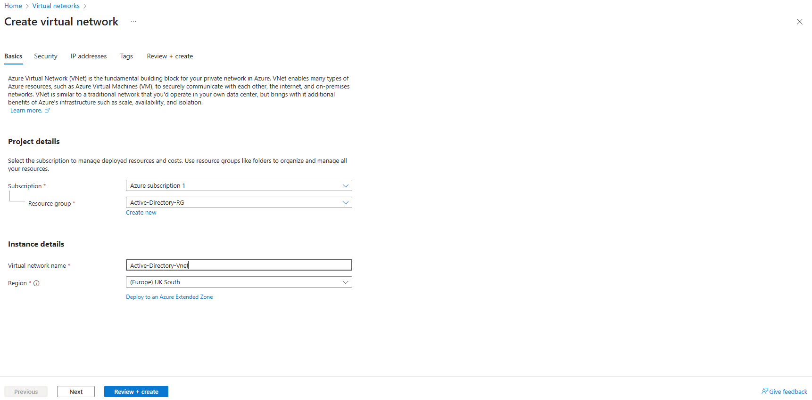
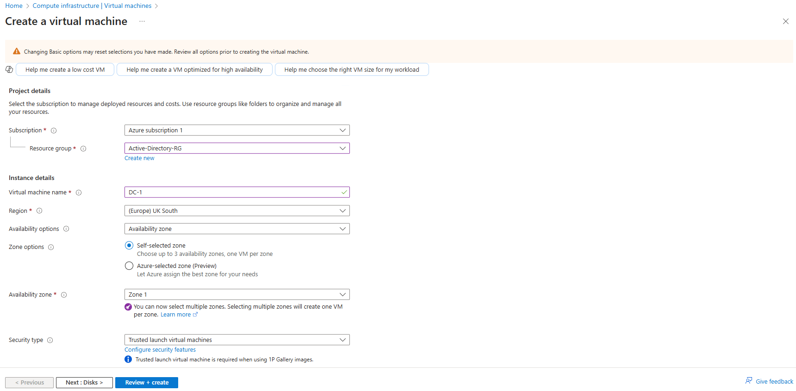

<p>After VM is created, set Domain Controller’s NIC Private IP address to be static</p>

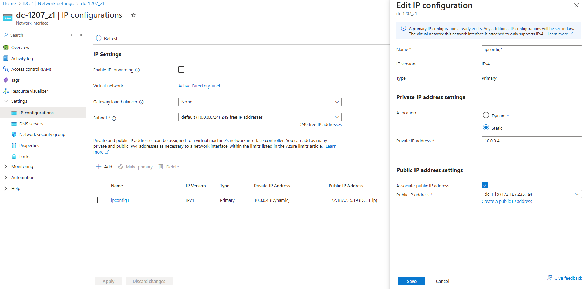

<p>Log into the VM and disable the Windows Firewall (for testing connectivity)</p>

- Domain Profile = OFF
- Private Profile = OFF
- Public Profile = OFF (Ensure this one is OFF)
    - Enter Apply

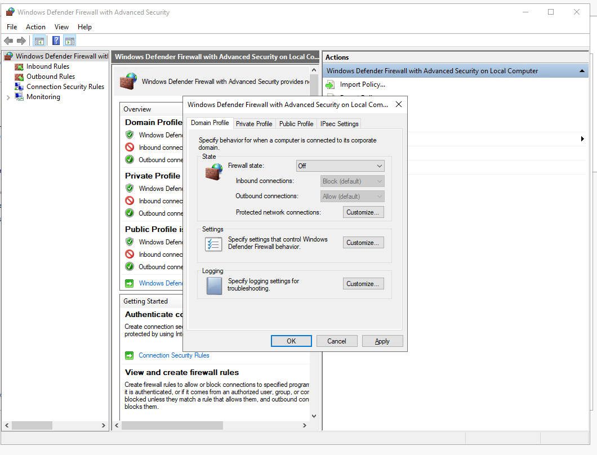

<br />

<h2>Setup Client-1 in Azure</h2>

<p> Create the Client VM (Windows10 Pro) named "Client-1". </p>

- Use the same Resource Group and Vnet that was created in previous step:
- Make sure to use the password option under the Administrator Account section (not seen in image)

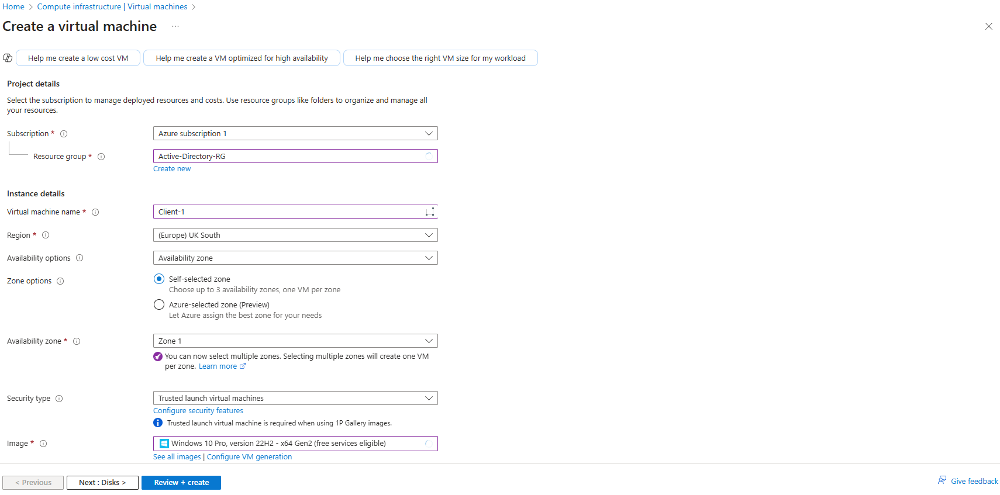

<p>
After VM is created, set Client-1’s DNS settings to DC-1’s Private IP address
</p>

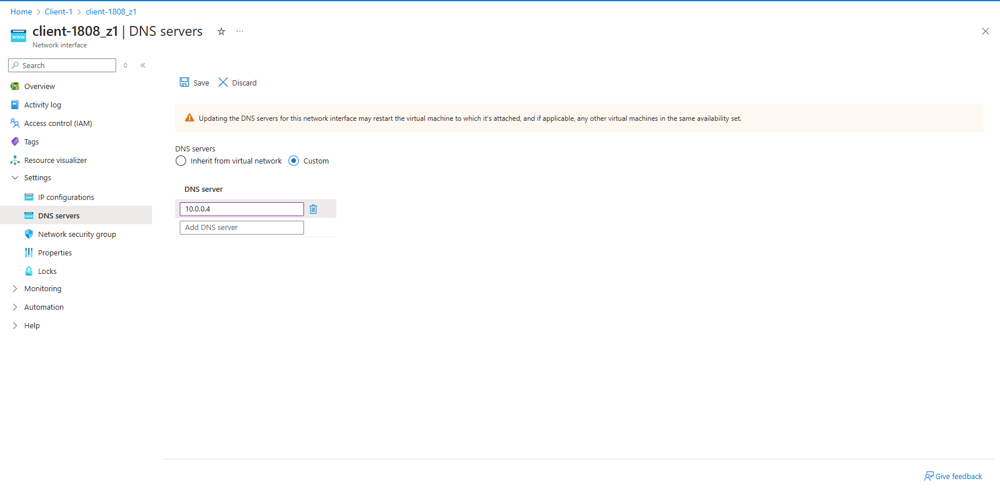

<br />

<h3 align="center">Ensure Connectivity between the client and Domain Controller</h3>

- From the Azure Portal, restart Client-1
    - Updating the DNS servers for this network interface may restart the virtual machine to which it’s attached, and if applicable, any other virtual machines in the same availability set.
- Login to Client-1
    - Attempt to ping DC-1’s private IP address

command prompt: 
```bash
  ping 10.0.0.4
```
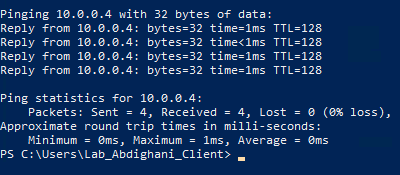


<p>From Client-1, open PowerShell and run ipconfig /all</p>

- The output for the DNS settings should show DC-1’s private IP Address

command prompt: 
```bash
  ipconfig /all
```
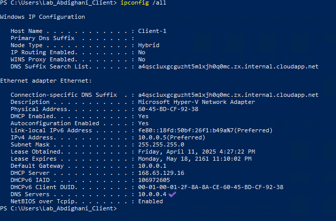

<br />

<h2>Install Active Directory</h2>

<p>
Open Server Manager (it usually loads automatically, or you can find it in the Start menu). Click "Add roles and features," accept the defaults, and select "Active Directory Domain Services" in the "Select Server Roles" section.
</p>

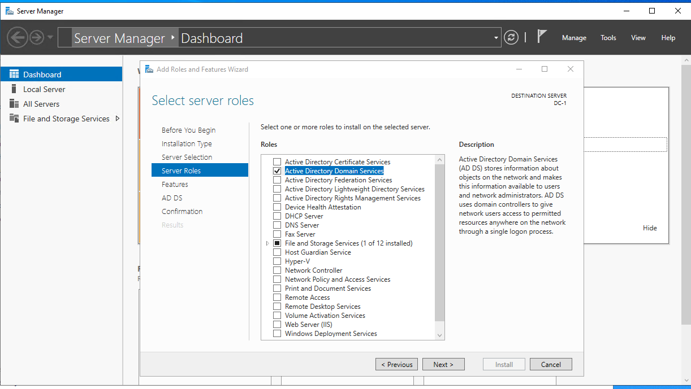

<p>
Continue with this and check Restart the destination server automatically if required before clicking Install. After installation is complete, go back to the Server manager and click on the flagged icon in the top right. Then, click on the link that says to Promote this server to a domain controller.
</p>

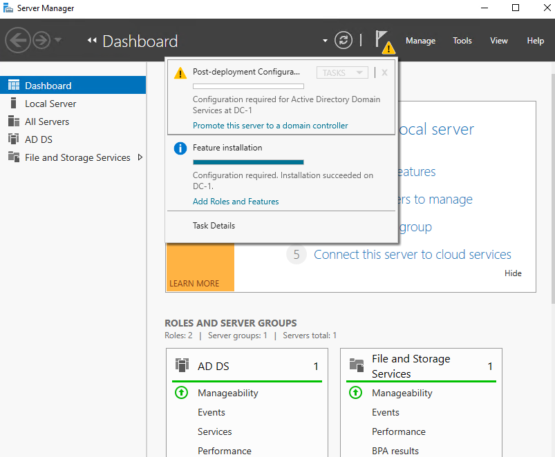

<p>In the deployment configuration, choose "Add a new forest"</p>

- Setup a new forest as myADproject.com

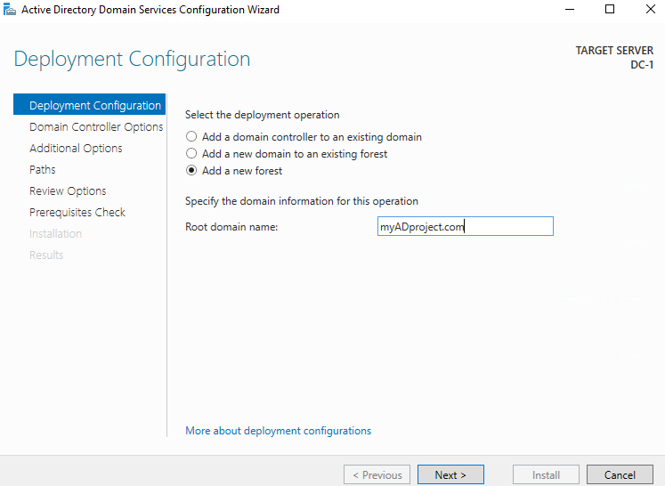

<p>
Continue the Active Directory configuration:

You'll be prompted to set a Directory Services Restore Mode password. Proceed with the remaining configuration steps. The server will restart to complete the Active Directory installation, and you'll be logged out.

- Restart and then log back into DC-1 as user: 
        `myADproject.com\Lab_Abdighani_DC`
</p>

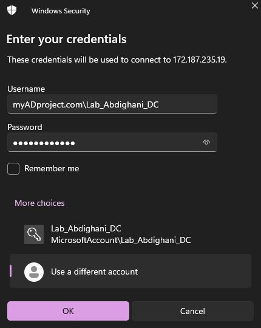
<br />

<h2>Create a Domain Admin user within the domain</h2>
<p>
In Active Directory Users and Computers (ADUC), create an Organizational Unit (OU) called <ins>“_EMPLOYEES” </ins> and another one called <ins>"_ADMINS":</ins>
</p>

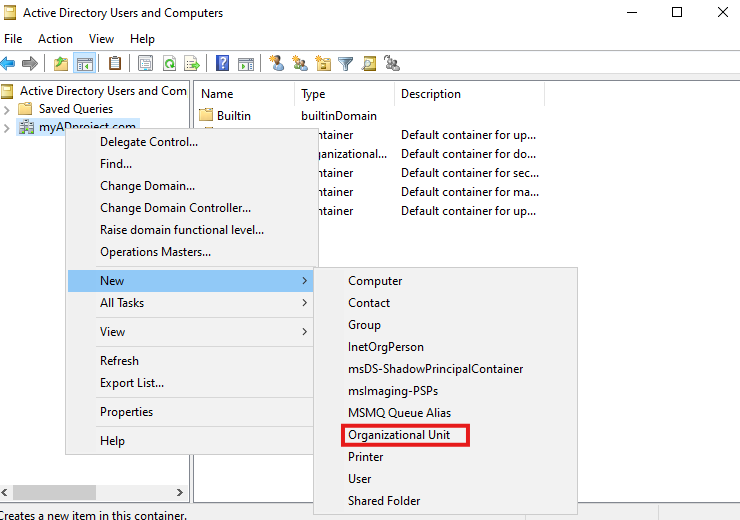
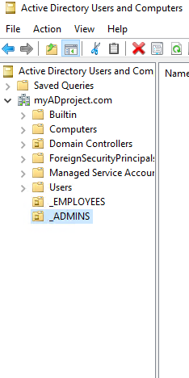

<p>Create a new employee named <b>Abdighani Mohamed</b> with the username of <b>abdighaniMD_admin</b>:</p>

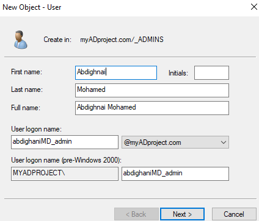

<p>Add <b>abdighaniMD_admin_admin</b> to the “Domain Admins” Security Group:</p>

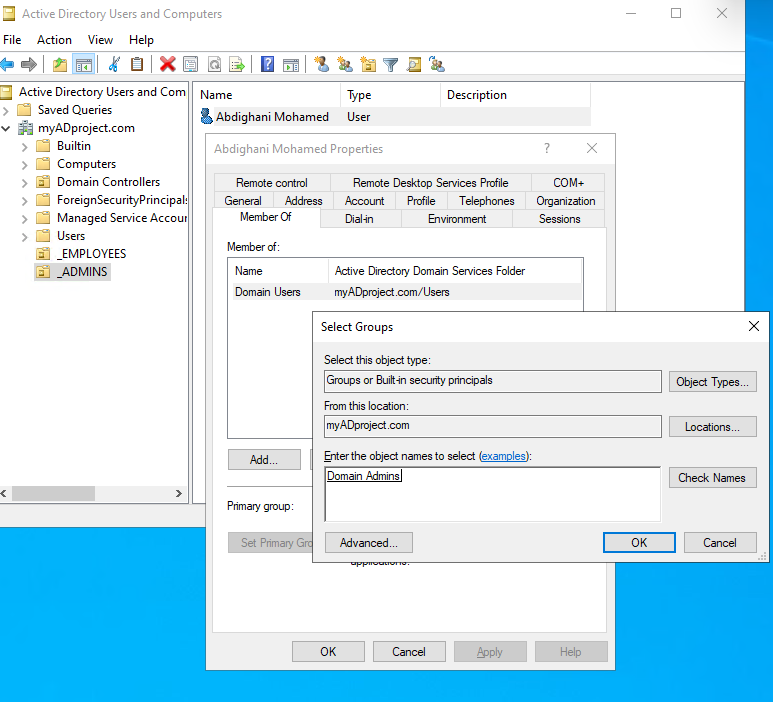

<p>
Log out/close the Remote Desktop connection to DC-1 and log back in as

    myADproject.com\abdighaniMD_admin

User `abdighaniMD_admin` as your admin account from now on:
</p>

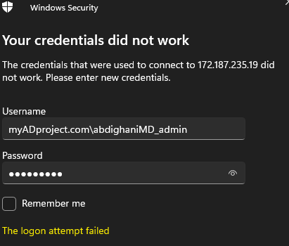

<h2 align="center">Join Client-1 to your domain myADproject.com</h2>

<p>
From the Azure Portal, set Client-1’s DNS settings to the DC’s Private IP address: [Done that above]

From the Azure Portal, restart Client-1 [Already done]

Login to Client-1 (Remote Desktop) as the original local admin [`Lab_Abdighani_Client`] and join it to the domain (computer will restart):
</p>

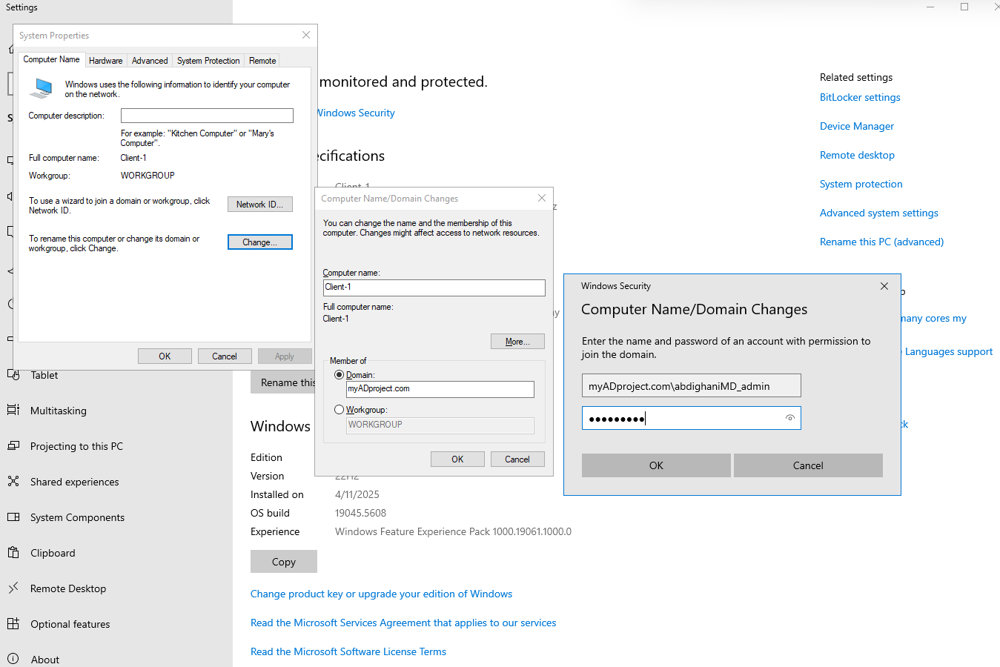

<p>
Login to the Domain Controller (Remote Desktop) and verify Client-1 shows up in Active Directory Users and Computers (ADUC) inside the <ins>“Computers” container</ins> on the root of the domain.
</p>

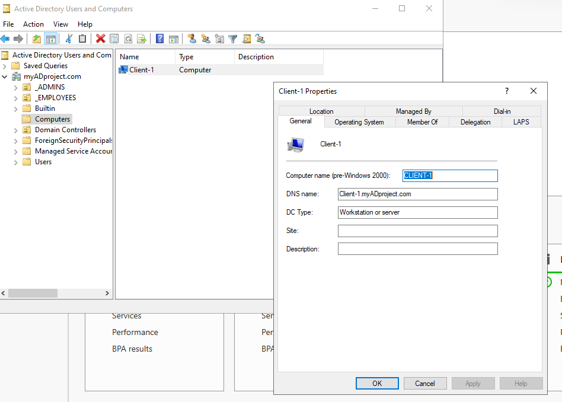

<br />

<h2>Setup Remote Desktop for non-administrative users on Client-1</h2>

<p>

Log into Client-1 as `myADproject.com\abdighaniMD_admin` and open system properties.

Click “Remote Desktop”.

Allow “domain users” access to remote desktop.

You can now log into Client-1 as a normal, non-administrative user now.
</p>

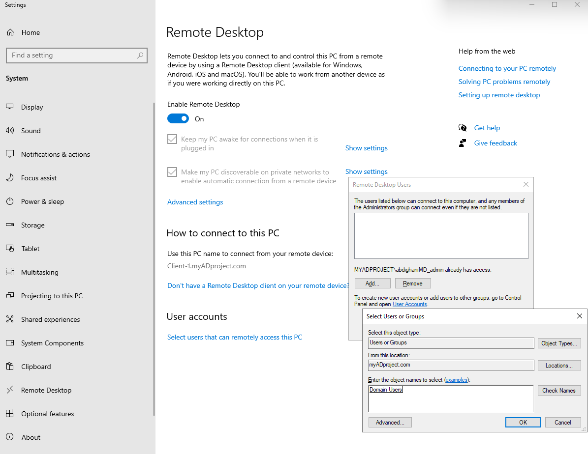

<br />

<h2>Create a bunch of additional users and attempt to log into client-1 with one of the users</h2>

- Login to DC-1 as `abdighaniMD_admin` 
- Open PowerShell_ise as an administrator
- Create a new File and paste the contents of this script:
```bash
 adscript.ps1
```
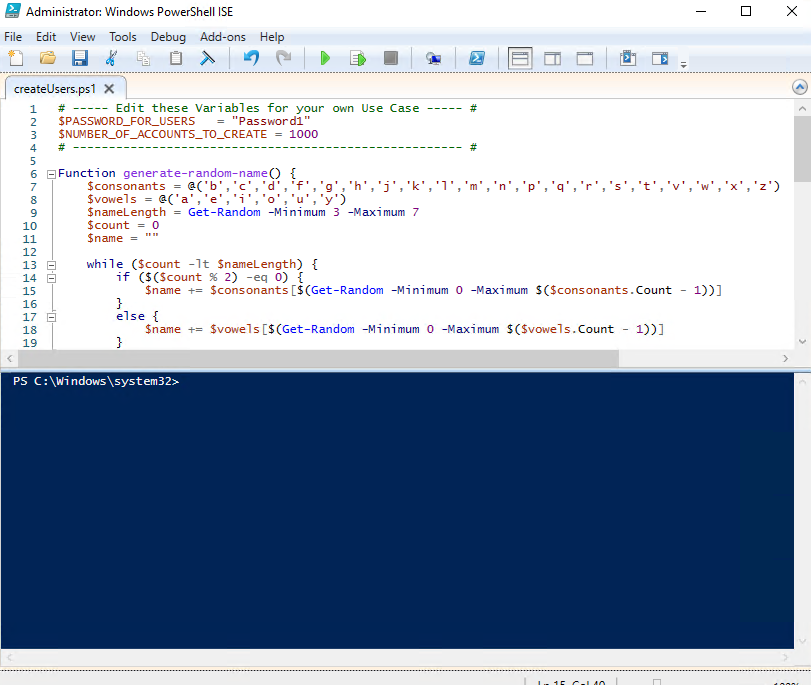

<p>
Run the script and observe the accounts being created
</p>

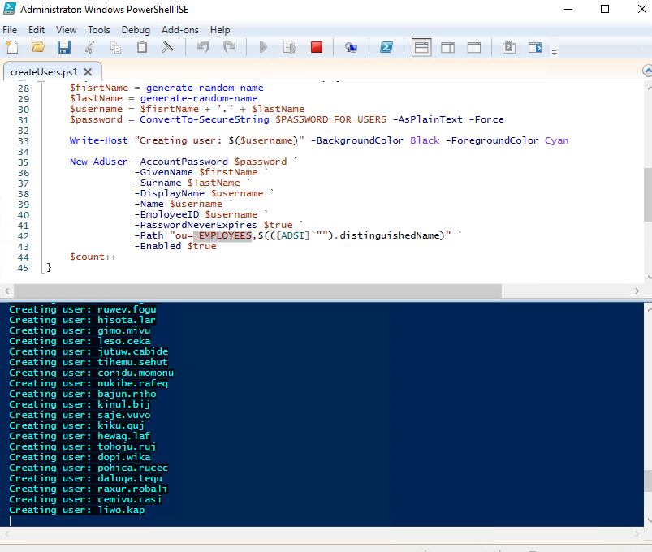

When finished, open ADUC and observe the accounts in the appropriate OU (`_EMPLOYEES`)
- attempt to log into Client-1 with one of the accounts (take note of the password in the script)

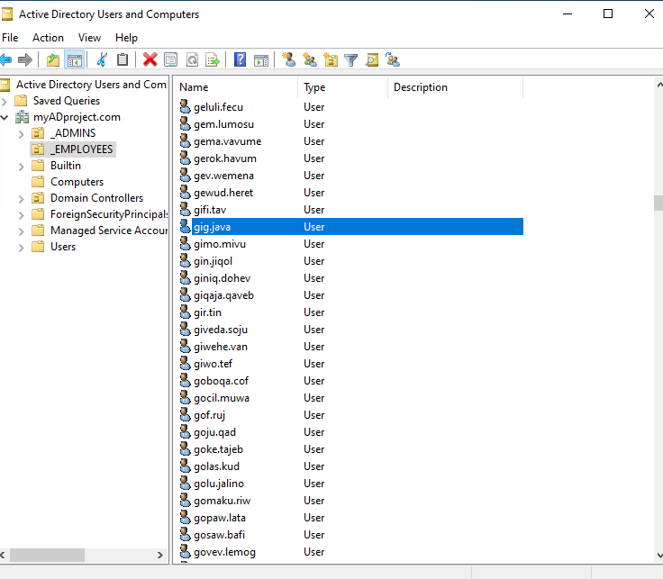

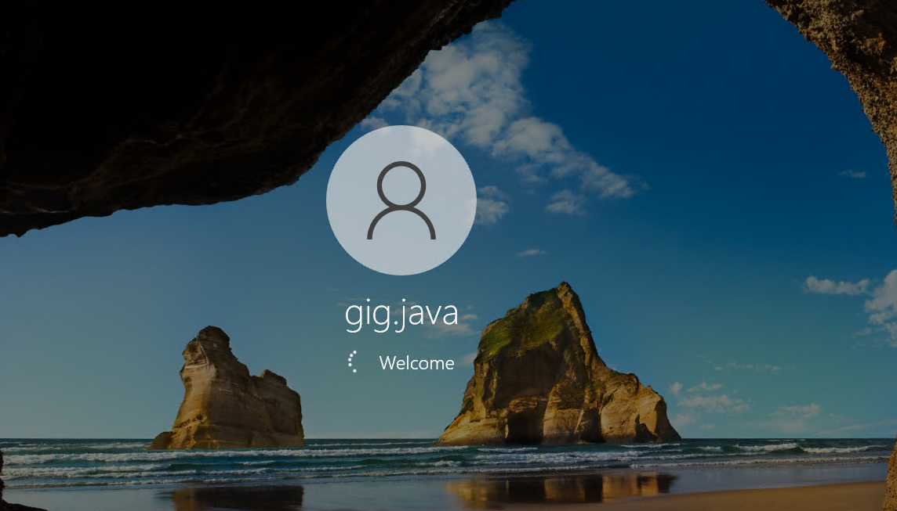
<br/>
<br/>

<h2 align="center">Configuring an account lockout policy in Active Directory using Group Policy </h2>

- Log in to a machine (DC-1) with Group Policy Management Console installed (typically, a Domain Controller).
- Click Start
    - type run 
    - type gpmc.msc in the search box

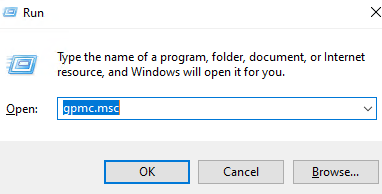

<br />

<h2>Create or Edit a Group Policy Object (GPO)</h2>

In the GPMC:
- Navigate to the Group Policy Objects section.
- Right-click Group Policy Objects
    - Select New to create a new GPO:
        - descriptive name if you're creating a new one, like <ins>"Account Lockout Policy"</ins>.
    - Right-click an existing GPO and select Edit to modify it.
        - But i have choosen to Edit the <b>"Default Domain Policy"</b>

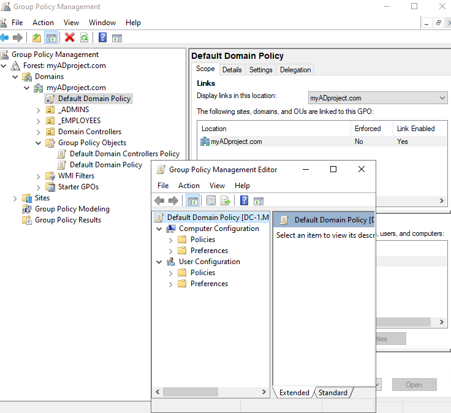

<h2> Navigate to the Account Lockout Policy Settings</h2>

- In the Group Policy Management Editor, expand the following:
    - Computer Configuration > Policies > Windows Settings > Security Settings > Account Policies > Account Lockout Policy.

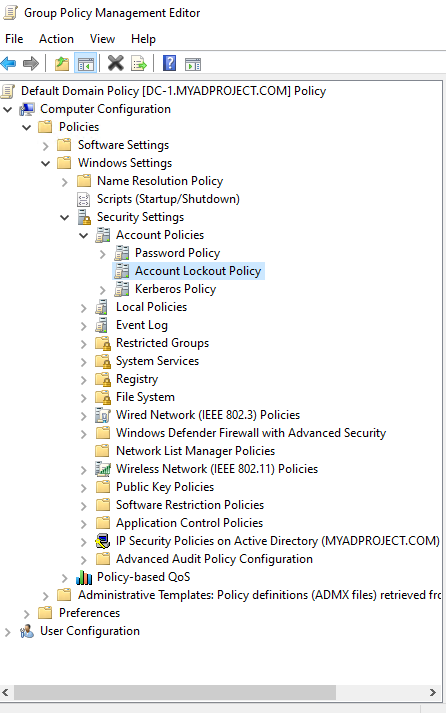

<h2>
Configure Account Lockout Policy Settings 
(three primary settings that you need to configure)
</h2>

<p align="center">Account Lockout Duration:</p>

- Definition:
    - The time in minutes that an account remains locked before it is automatically unlocked.
- Configuration:
    - Double-click on this setting, select Define this policy setting, and then set the duration (e.g., 30 minutes).

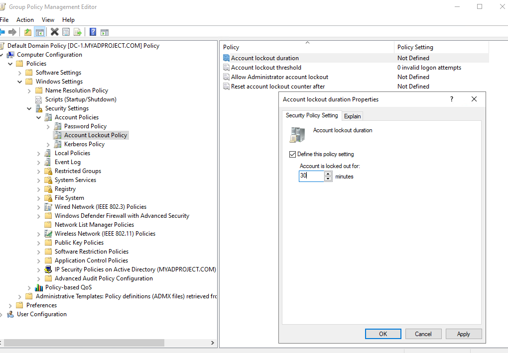

<p align="center">Account Lockout Threshold:</p>

- Definition:
    - The number of failed logon attempts that will trigger an account lockout.
- Configuration: 
    - Double-click on this setting, select Define this policy setting, and then set the threshold (e.g., 3 invalid attempts).

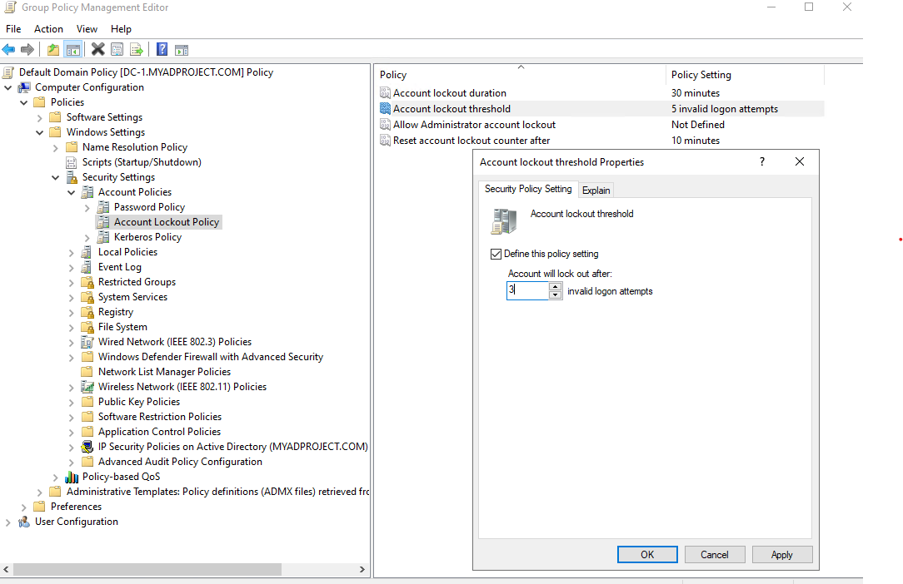

<p align="center">Reset Account Lockout Counter After:</p>

- Definition:
    - The time in minutes after which the failed logon attempts counter is reset to 0, assuming there are no additional failed logon attempts.
- Configuration:
    - Double-click on this setting, select Define this policy setting, and then set the time (e.g., 15 minutes).

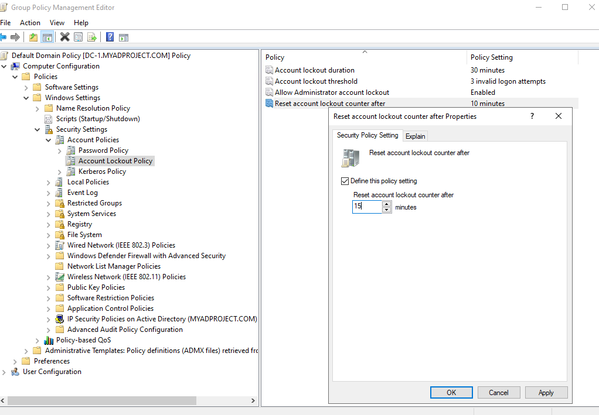

<h2>Link the GPO to an Organizational Unit (OU):</h2>

- Once the GPO is configured, you need to link it to the appropriate Organizational Unit (OU) or domain where you want the policy to apply.
- In the GPMC, 
    - right-click the OU or domain where you want to apply the GPO and select Link an Existing GPO.
- Choose the GPO you created or modified earlier and click OK.

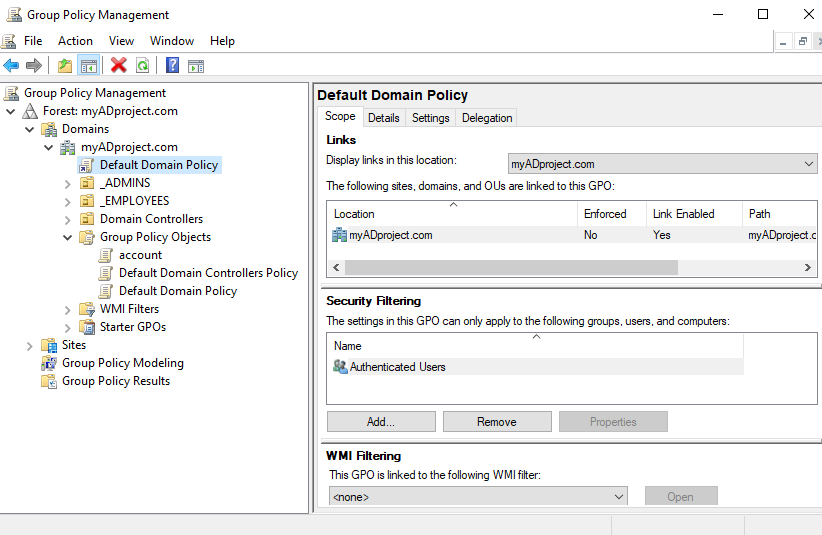

<h2>Update Group Policy:</h2>

- You can wait for the Group Policy to propagate automatically, or you can force an update immediately.
    - On a client machine or server, open Command Prompt:

```bash
    gpupdate /force
 ```

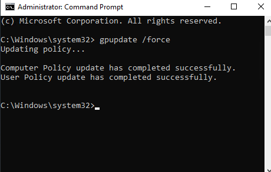


<h2>Verify the Policy:</h2>

- To verify the policy, you can use the rsop.msc (Resultant Set of Policy) tool on a client machine to see the applied settings.

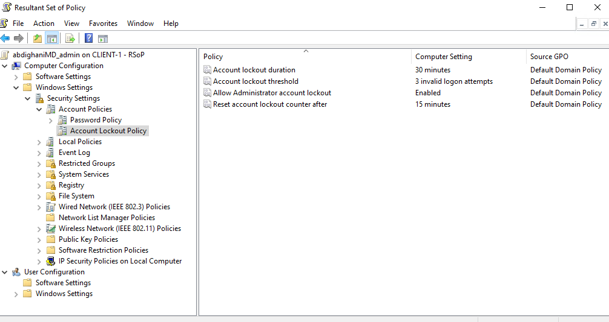

<br/>
<h2>Conclusion</h2>

In this lab, we deployed and configured a working Active Directory environment. We set up a Domain Controller and a client machine in Azure, ensured they could communicate, and installed Active Directory Domain Services. After creating a new domain, we added organizational units and user accounts, including an admin account, and joined the client to the domain.

We also configured Remote Desktop access for domain users and used a PowerShell script to generate additional users. Next, we tested logging into the client with one of the new accounts. Then we configured an account lockout policy in Active Directory using Group Policy involves defining settings that control when an account is locked after multiple failed login attempts, how long the account remains locked, and how the lockout counter is reset. This lab gave us hands-on experience with essential Active Directory tasks and configurations.

## Author

- [@AbdighaniMD](https://github.com/AbdighaniMD)
