<p align="center">


</p>

# **On-premises Domain Name System (DNS) Deployed in the Cloud (Azure)**
<p>
Domain Name System (DNS) converts computer names (such as client-1.myADproject.com or www.google.com) to IP addresses which can be used by the computer to locate resources.

DND is integrated with Active Directory and automatically got installed on DC-1 in the last lab.

In this lab we will use Client-1 and DC-1 to do a few exercises in order to understand DNS a bit better.
</p>

<h2>Requirements</h2>

We will continue from where we left off the previous session with the following setup:
 - Active Directory running in Azure on Virtual machine (DC-1)
 - Client Machine running in Azure on Virtual machine (Client-1) and joined to the domain 
    - [@Configuring On-premises Active Directory within Azure VMs](../Configuring%20On-premises%20Active%20Directory%20within%20Azure%20VMs/)


<h2>High-Level-Overview</h2>

- Inspect DNS A-Records on the server (hostname to IP address mappings)
- Create some of our own A-Records on the server and observe them from the client
- Delete records from server and observe the client DNS cache to gain understanding
- Create a "CNAME" records (mapping one name to another name) 


<h2>Deployment and Configuration Steps</h2>
<h3 align="center">A-Record Exercise</h3>

- Turn on the DC-1 and Client-1 VMs in the Azure Portal if they are off.
    - Connect/log into DC-1 as your domain admin account [ `myADproject.com\abdighaniMD_admin` ]
    - Connect/log into Client-1 as an admin [ `myADproject.com\abdighaniMD_admin` ]

<p>From Client-1 try to ping “mainframe” notice that it fails</p>

command prompt:
```powershell
    ping mainframe
```    
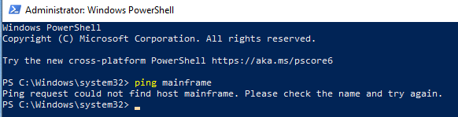

<p> Nslookup “mainframe” notice that it fails (no DNS record) </p>

command prompt: 
```powershell
    nslookup mainframe
    ipconfig /displaydns
```
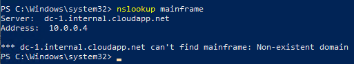
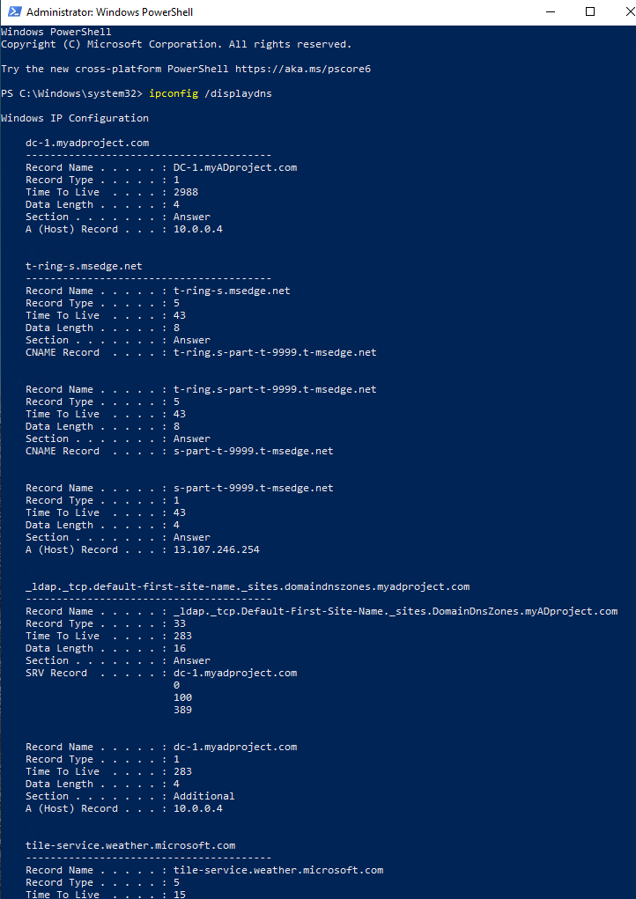


<p>Create a DNS A-record on DC-1 for “mainframe” and have it point to DC-1’s Private IP address</p>

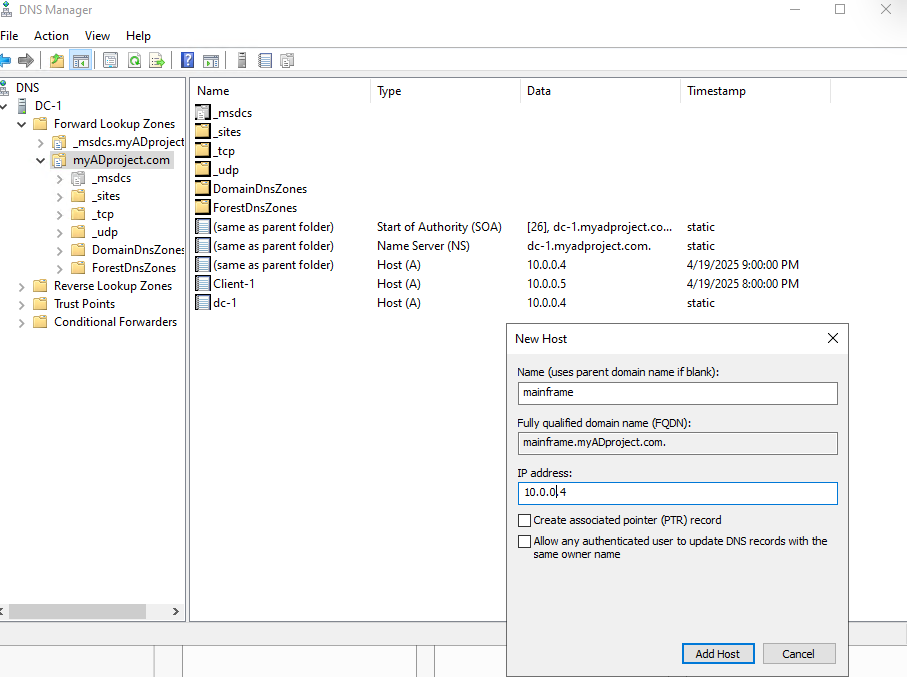

- Go back to Client-1 and try to ping it. Observe that it works

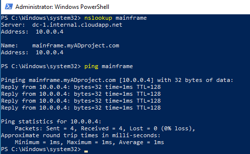


<h3 align="center">Local DNS Cache Exercise</h3>

<p>Go back to DC-1 and change mainframe’s record address to 8.8.8.8</p>

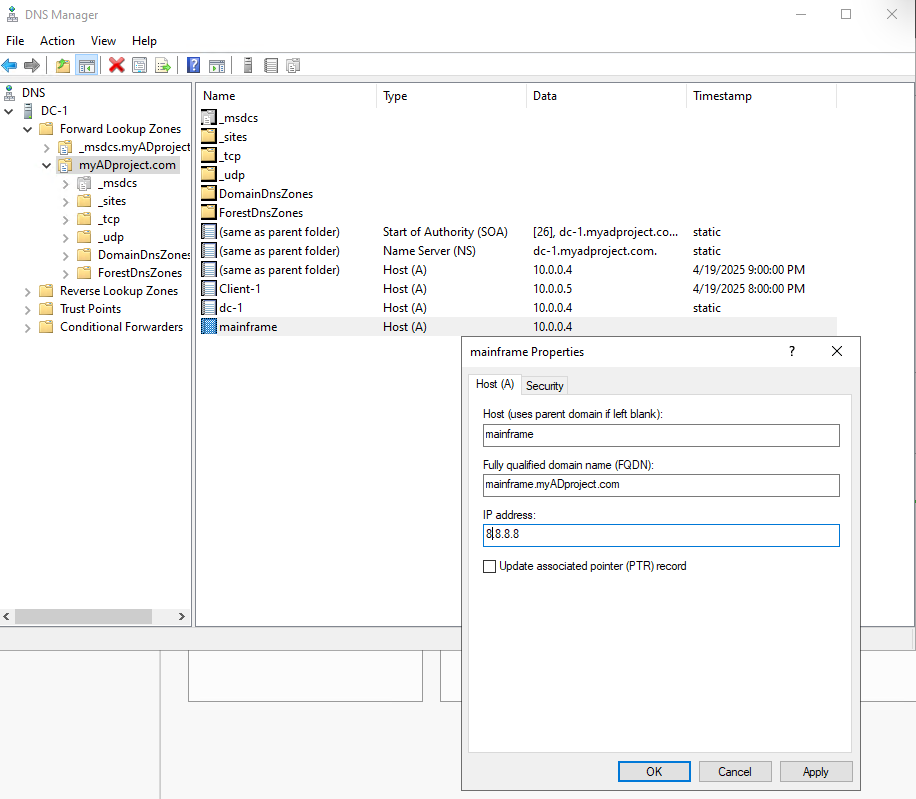

<p>Go back to Client-1 and ping “mainframe” again. Observe that it still pings the old address</p>

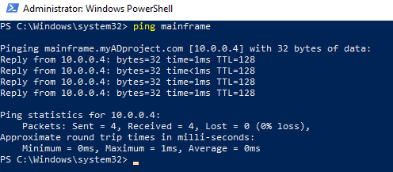

<p>Observe the local dns cache (ipconfig /displaydns)</p>

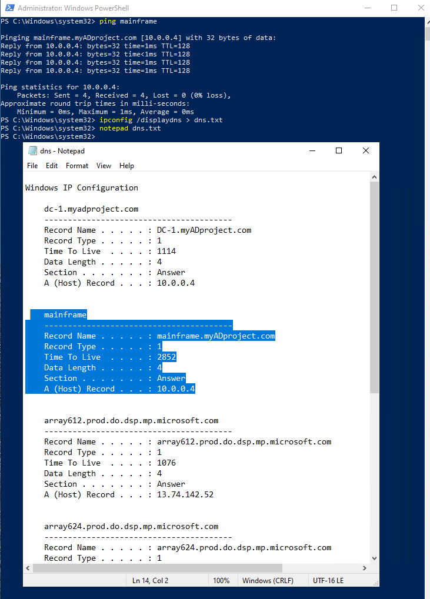

<p>Flush the DNS cache (ipconfig /flushdns).</p>

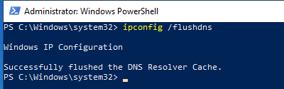

<p>Observe that the cache is empty (ipconfig /displaydns)</p>

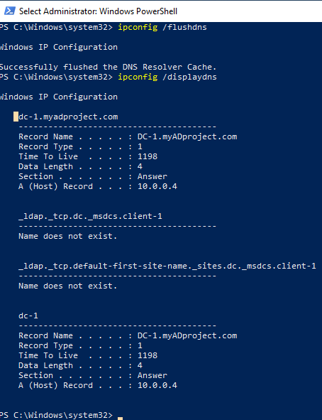

<p>Attempt to ping “mainframe” again. Observe the address of the new record is showing up</p>

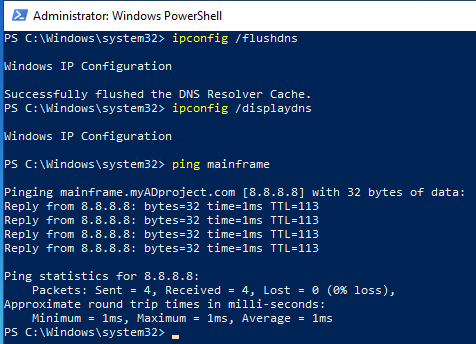

<h3 align="center">CNAME Record Exercise</h3>


<p>Go back to DC-1 and create a CNAME record that points the host “search” to “www.google.com”</p>

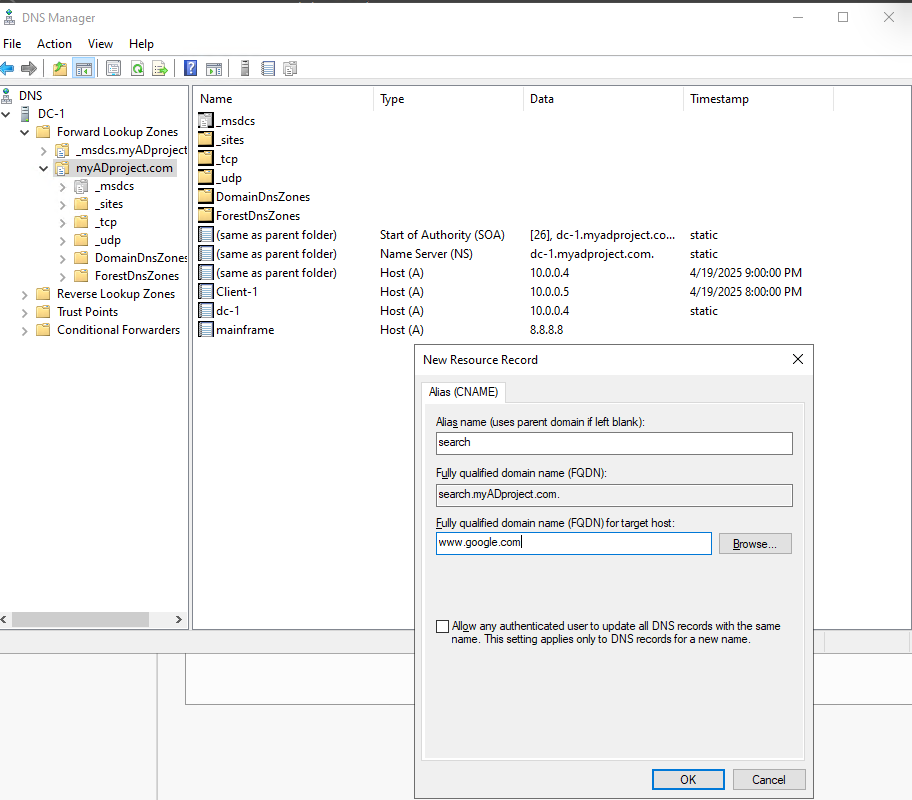

<p>Go back to Client-1 and attempt to ping “search”, observe the results of the CNAME record</p>

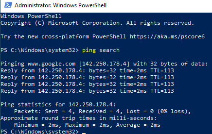

<p>On Client-1, nslookup “search”, observe the results of the CNAME record</p>

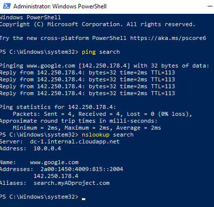


## Author

- [@AbdighaniMD](https://github.com/AbdighaniMD)

