<p align="center">


</p>

# **Azure Network File Shares and Permissions Management**

<p>

This lab demonstrates the practical implementation of network file sharing and permission management within a Microsoft Azure environment. 

Simulates a small business network with Active Directory, a Windows Server (acting as a Domain Controller), and a Windows 10 client machine.

The core focus is on effectively sharing resources over the network and configuring NTFS and share permissions to control access for simulated users and groups managed by Active Directory.

This hands-on experience demonstrates the ability to:
- Create and manage network file shares with varying levels of access (Read, Write, Deny).
- Implement and troubleshoot user and group-based permissions using Active Directory.
- Gain practical experience with Windows Server and Windows 10 in a domain-joined environment.
- Develop a foundational understanding of security best practices related to file sharing.

</p>

<h2>Requirements</h2>

We will continue from where we left off the previous session with the following setup:
 - Active Directory running in Azure on Virtual machine `DC-1`
 - Client Machine running in Azure on Virtual machine `Client-1` and joined to the domain 
    - [@Configuring On-premises Active Directory within Azure VMs](../Configuring%20On-premises%20Active%20Directory%20within%20Azure%20VMs/)


<h2>Deployment and Configuration Steps</h2>
<h3 align="center">Create some sample file shares with various permissions</h3>

- Turn on the DC-1 and Client-1 VMs in the Azure Portal if they are off.
    - Connect/log into DC-1 as your domain admin account [`myADproject.com\abdighaniMD_admin`]
    - Connect/log into Client-1 as a normal user [`myADproject.com\<someuser>`]

- Creating Folders using PowerShell:
    - Opened PowerShell on the Windows Server (Domain Controller - `DC-1`) with administrator privileges.
    - Executed the following PowerShell commands (code obtained through research) to create four new directories in the `C:\` drive:
        ```powershell
        New-Item -Path "read-access", "write-access", "no-access", "accounting" -ItemType Directory
        ```

    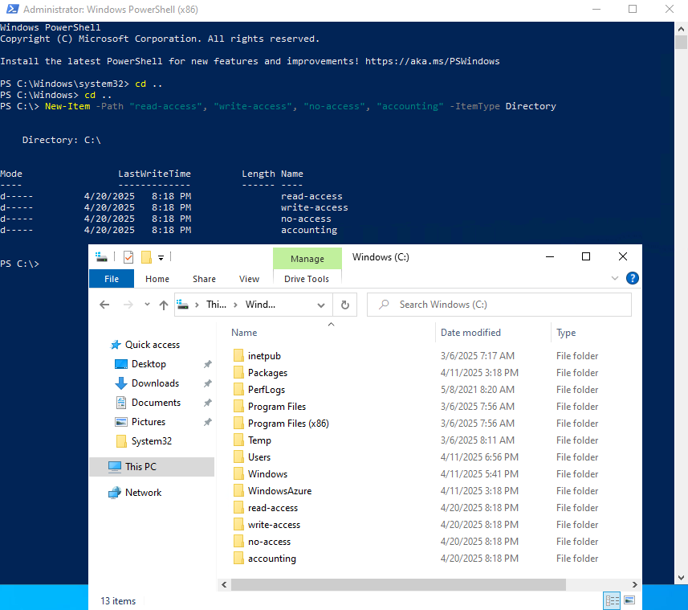

<br />

<p align="center">Configuring Share Permissions</p>

This section outlines the configuration of share permissions for each of the created folders.

1.  <h4>Setting Share Permissions for "read-access":</h4>

    Folder: “read-access”, Group: “Domain Users”, "Permission: “Read”

    - Right-clicked on the "read-access" folder in File Explorer.
    - Selected "Properties" and navigated to the "Sharing" tab.
    - Clicked the "Share..." button.
    - In the "Add people to share with" window, typed "Domain Users", selected the group, and clicked "Add".
    - The default permission level for "Domain Users" is "Read".

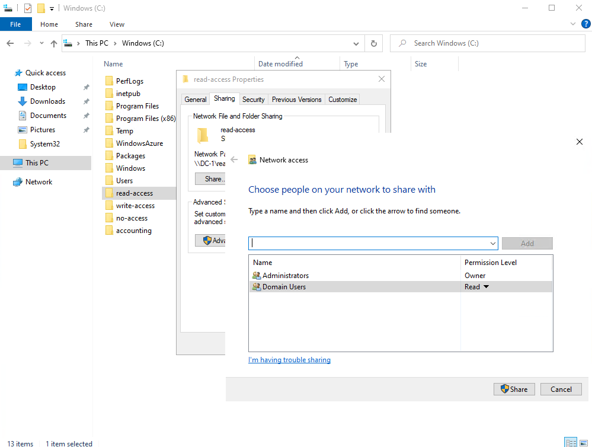


2.  <h4>Setting Share Permissions for "write-access":</h4>

    Folder: “write-access”,  Group: “Domain Users”, "Permissions: “Read/Write”

    - Right-clicked on the "write-access" folder in File Explorer.
    - Selected "Properties" and navigated to the "Sharing" tab.
    - Clicked "Share...".
    - Added the "Domain Users" group and changed the permission level for "Domain Users" from "Read" to "Read/Write" using the dropdown menu. 
    - Clicked "Share" and then "Done".

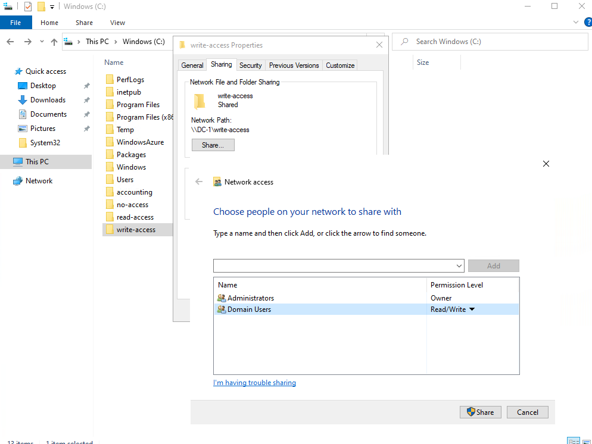

3.  <h4>Setting Share Permissions for "no-access":</h4>

    Folder: “no-access”, Group: “Domain Admins”, “Permissions: “Read/Write”

    - Right-clicked on the "no-access" folder in File Explorer.
    - Selected "Properties" and navigated to the "Sharing" tab.
    - Clicked "Share...".
    - Added the "Domain Admins" group and ensured their permission level was set to "Read/Write".
    - Note: 
        - By granting "Read/Write" permissions only to "Domain Admins" at the share level, regular "Domain Users" will effectively be denied access to this share. Clicked "Share" and then "Done".

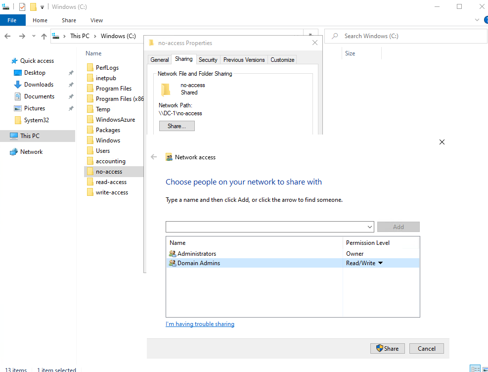

<h2>Attempt to access file shares as a normal user</h2>

This section details the attempts to access the newly created file shares from a domain-joined Windows 10 client machine ("Client-1") using a standard domain user account.

1.  <h4>Navigating to Shared Folders:</h4>

    - Logged into `Client-1` using a standard domain user account (`<someuser>`).
    - Opened File Explorer and in the address bar, typed `\\DC-1` (the UNC path to the file server) and pressed Enter to view the available network shares.( when accessed by a standard domain user.)

<p align="center">

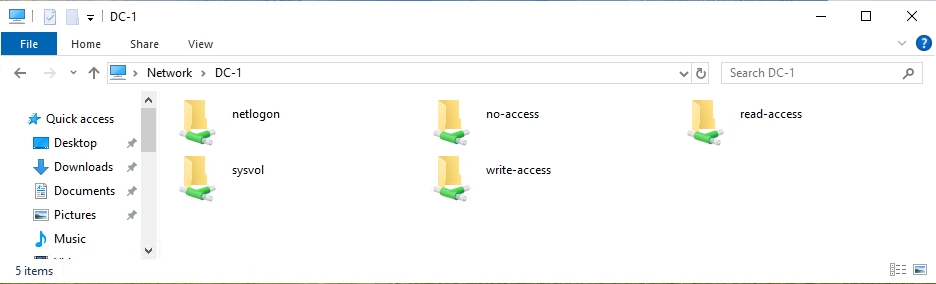
</p>

2.  <h4>Accessing "read-access" Folder:</h4>

- Attempted to open the "read-access" folder.
- Result: The folder opened successfully, indicating that the "Read" share permission for "Domain Users" is working.
- Attempted to create a new text file within the "read-access" folder.
- Result:
    - The attempt failed, and an error message indicating insufficient permissions was displayed. This confirms that the "Read" share permission only allows viewing files and folders, not modification.

<p align="center">

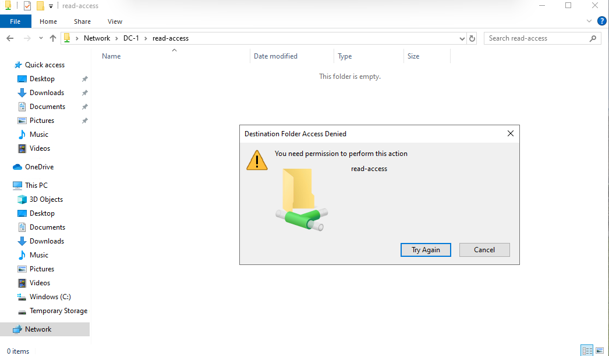
</p>

3.  <h4>Accessing and Writing to "write-access" Folder:</h4>

- Attempted to open the "write-access" folder.
- Result: The folder opened successfully.
- Attempted to create a new text file within the "write-access" folder.
- Result:
<p align="center">

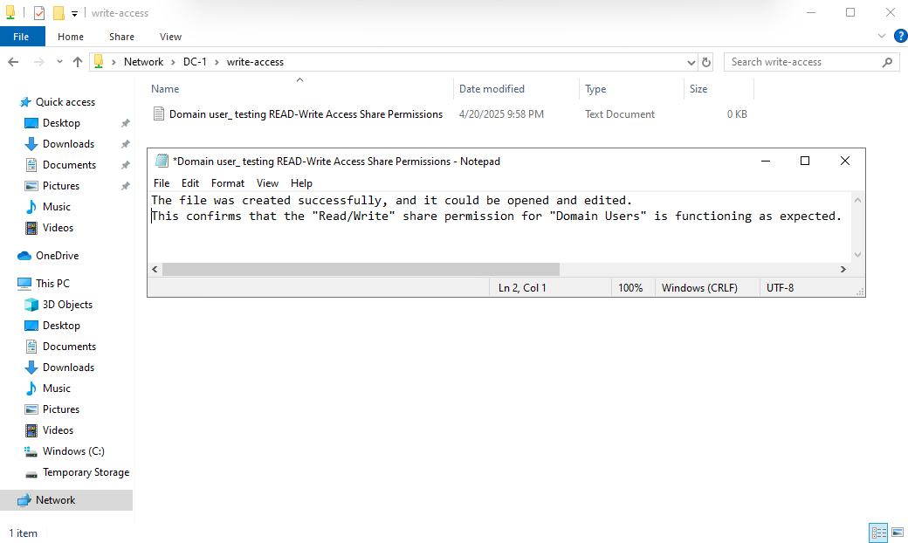
</p>

4.  <h4>Accessing "no-access" Folder:</h4>

- Attempted to open the `\\DC-1\no-access` share.
- Result:
    - An "Access Denied" error message was displayed. This confirms that because the standard "Domain Users" group does not have any share permissions on this folder (only "Domain Admins" do), access is correctly denied.

<p align="center">

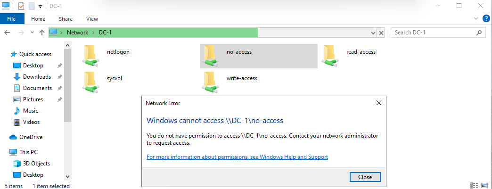
</p>

<h2>Create an “ACCOUNTANTS” Security Group, assign permissions, an test access</h2>

This section demonstrates the creation of a security group in Active Directory and the assignment of permissions to a specific shared folder.

1. <h4>Creating the "ACCOUNTANTS" Security Group:</h4>

- Logged back into the Domain Controller (`DC-1`) with administrative credentials.
- Opened "Active Directory Users and Computers".
- Created a new Organizational Unit (OU) named `_GROUPS` for better organization of groups.

<p align="center">

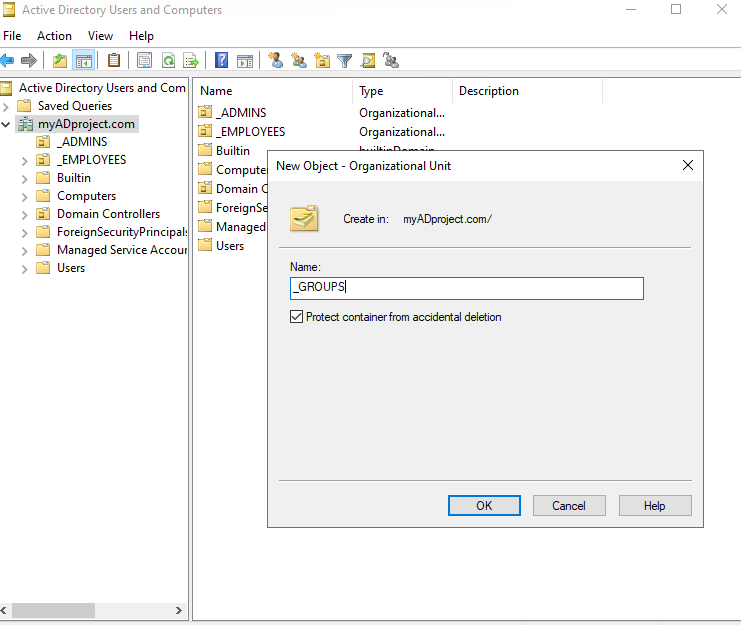
</p>

<p>

Within the `_GROUPS" OU`, created a new Security Group named `ACCOUNTANTS` with a Global scope.
</p>

<p align="center">

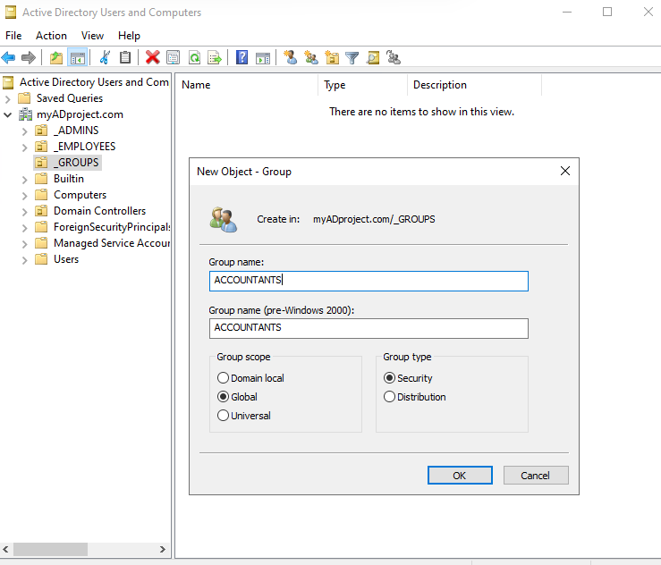
</p>

2. <h4>Setting Share Permissions for "accounting" Folder:</h4>

- Right-clicked on the "accounting" folder on `DC-1`
- selected "Properties", and navigated to the "Sharing" tab.
- Clicked "Share...".
- Removed the "Domain Users" group (if it was present).
- Added the "ACCOUNTANTS" security group and granted them "Read/Write" permission.

<p align="center">

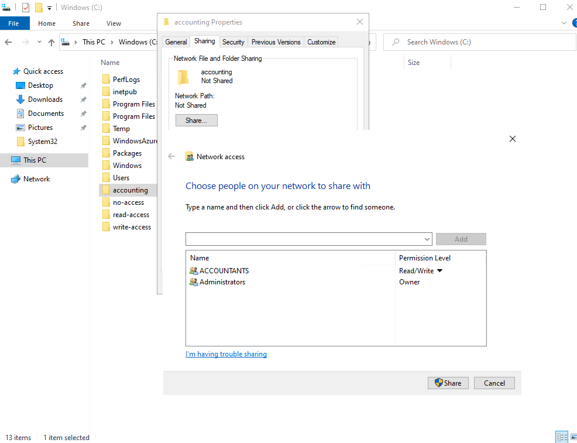
</p>

3. <h4>Testing Access Before Group Membership:</h4>

    - Logged back into `Client-1` as the standard user (`<someuser>`).
    - Attempted to access the `\\DC-1\\accounting` share.
    - Result:
        - Access was denied because the user `<someuser>` is not yet a member of the "ACCOUNTANTS" group.
<p align="center">

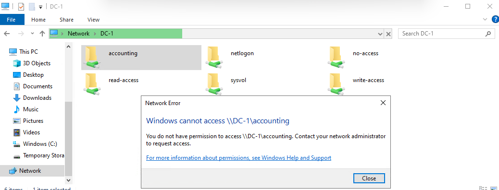
</p>

4. <h4>Adding User to the "ACCOUNTANTS" Security Group:</h4>

    - Logged back into the Domain Controller (`DC-1`) with administrative credentials.
    - Opened "Active Directory Users and Computers".
    - Located the user account `<someuser>` and added them as a member of the "ACCOUNTANTS" security group.

<p align="center">

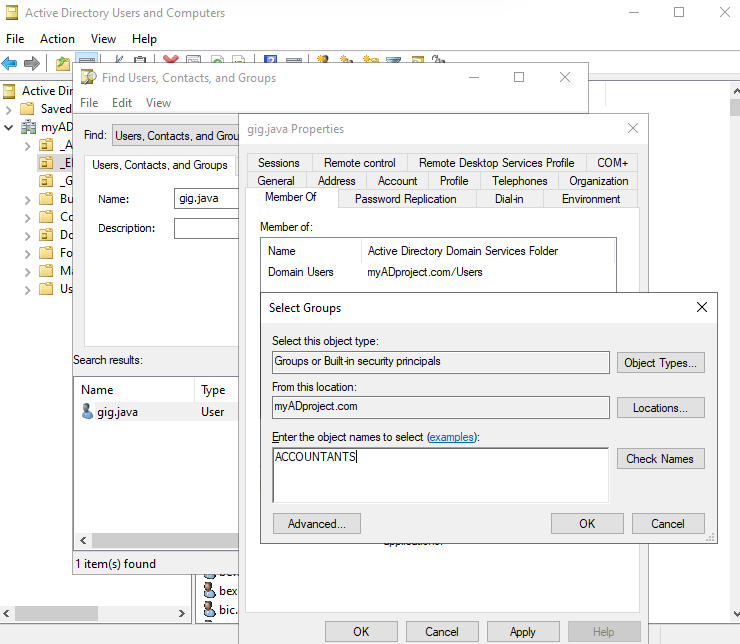
</p>

5. <h4>Testing Access After Group Membership:</h4>

    - Logged out of `Client-1` and logged back in as the standard user (`<someuser>`).
    - Attempted to access the `\\DC-1\\accounting` share again.
    - Result:
        - The user now had "Read/Write" access to the "accounting" folder. The user could open the folder, create new files, and edit existing ones. This demonstrates the successful implementation of group-based share permissions using Active Directory.

<p align="center">

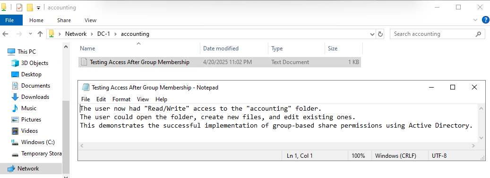
</p>

<h2>Conclusion</h2>
This lab successfully demonstrated the creation and management of network file shares with varying permission levels in an Azure-based Active Directory environment. By configuring share permissions for individual folders and leveraging Active Directory security groups, we effectively controlled access for a standard domain user. The results of the access tests aligned with the configured permissions, showcasing the fundamental principles of network file sharing and permission management. This exercise provides valuable hands-on experience relevant to IT support and help desk roles, highlighting the ability to implement and troubleshoot file access in a domain environment.

## Author

- [@AbdighaniMD](https://github.com/AbdighaniMD)